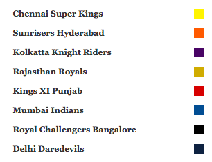

---
title: 'My IPL dashboard'
output:
    flexdashboard::flex_dashboard:
      orientation: rows
      vertical_layout: scroll
      logo: icon.png
      theme: flatly
      author: Harinee Mosur Narasimhan
      
      
--- 
<style>                     
.navbar {
  background-color:darkblue;
  border-color:white;
}
.navbar-brand {
color:white!important;
}
sidebar{
  background-color: black;
}
.comment{
	font-size: 1em;
  font-family: 'Georgia';
 }
</style>                    

# my Flex board {.bgred} {.sidebar }
<span class="comment">This is a visual summary of IPL 2018 that I have done using R. The packages used are ggplot2, plotly and tidyverse.I have used flexdashboard to prepare the dashboard. Hope you like it.Please mouseover all graphs for details</span>

 

```{r include = FALSE}

knitr::opts_chunk$set(cache = TRUE)

library(ggplot2)
library(tidyverse)
library(plotly)
batsmen<-read.csv("batsmen.csv")
captain <- read.csv("Captain.csv")
iplsummary<-read.csv("ipl2018.csv")
bowlers<-read.csv("bowlers.csv")
ipl<-read.csv("matches2018.csv",stringsAsFactors = FALSE)
ipl$X<-NULL
ipl$X.1<-NULL
ipl$Allbyes<-ipl$legby+ipl$bye
iplsummary$Loser<-ifelse(iplsummary$Winner==iplsummary$Team.A,as.character(iplsummary$Team.B),as.character(iplsummary$Team.A))
iplsummary$Win_Score<-ifelse(iplsummary$Winner==iplsummary$Team.A,as.numeric(iplsummary$Score.A),as.numeric(iplsummary$Score.B))
iplsummary$Losing_Score<-ifelse(iplsummary$Winner==iplsummary$Team.A,as.numeric(iplsummary$Score.B),as.numeric(iplsummary$Score.A))

ipl<-read.csv("matches2018.csv",stringsAsFactors = FALSE)
ipl$X<-NULL
ipl$X.1<-NULL
ipl$Runs<-ifelse(ipl$Win==0,-ipl$Score,ipl$Score)


m<-filter(ipl,(Num==6)|(Num==18))

ann<- list(
  x = m$Num,
  y = m$Runs,
  text = "D/L method",
  xref = "x",
  yref = "y",
  showarrow = TRUE,
  arrowhead = 7,
  ax = 20,
  ay = -40
)


col <- c('#FEEE52','#12243F','#411C62','#C4332C','#1D528E','#000000','#CBAA3C','#EC693A')
f <- list(
  face="bold",
  family="Georgia",
  color="black",
  size = 11

)
y <- list(
  title = "x Axis",
  titlefont = f
)
nx <- list(
  title = "",
  zeroline = FALSE,
  showline = FALSE,
  showticklabels = FALSE,
  showgrid = FALSE
)
ay<- list(
  title = "Runs",
  titlefont = f
  )

atitle=list(
  title='IPL 2018 Match Results',
  size=15, 
  face="bold", 
  family="American Typewriter",
  color="tomato",
  hjust=0.5,
  lineheight=1.2 )

tfont = list(size=15, 
  face="bold", 
  family="Georgia",
  color="black",
  hjust=0.5,
  lineheight=1.2 )

```
Match Summary 
===================================== 

Row 
-------------------------------------
    
### All Match Results with the Winners in the positive axis and Losers in the negative axis


```{r}
p<- plot_ly(ipl) %>%
  add_bars(x = ~Num, y = ~Runs, color = ~Team,colors=col,alpha=1/3,width=1,
           text = ~Match,hoverinfo="text+y",textposition = 'auto',inherit=FALSE,
           marker = list(
                         line = list(color = 'rgb(8,48,107)', width = 1.5,face="bold")
                         )
           ) %>%
  layout(barmode = "group",bargap = 1.0,
         title = atitle,annotations=ann,
         yaxis=ay, paper_bgcolor = 'rgb(243, 243, 243)',autosize=T,
         plot_bgcolor = 'rgb(243, 243, 243)',xaxis=nx,showlegend = FALSE)
  
p


```

## Row 
-------------------------------------
### IPL Match Wins by Team 


```{r}
gg<-ggplot(iplsummary, aes(Winner,fill=Loser)) +
  geom_bar(color="white",width=0.5) +
  labs(title="", y="Matches", x="Winners")+
  scale_fill_manual(values = col)+
  theme(plot.title=element_text(),  # title
                        axis.title.y=element_text(f),  # Y axis title
        axis.text.y=element_text(size=10),
        axis.title.x=element_text(f),
        axis.text.x=element_text(size=10),
        panel.background = element_rect(fill = 'white'),
        panel.grid.major = element_blank(),
        panel.grid.minor = element_line(colour = "tomato",
                                        size=.25,
                                        linetype = "dashed"),
        panel.border = element_blank(),
        axis.line.x = element_line(colour = "darkorange",
                                   size=1.5,
                                   lineend = "butt"),
        axis.line.y = element_line(colour = "darkorange",
                                   size=1.5)
        ,legend.position = "None"
  )

p<-ggplotly(gg, tooltip = c("x","y","fill")) %>%
  layout(showlegend = FALSE,plot_bgcolor = 'rgb(243, 243, 243)')
p

```


>CSK the only team to beat all other teams at least once,followed by SRH which couldnt win against CSK and KKR which couldnt win againt MI.

Individual
===================================== 
## Row {data-height=600}
-------------------------------------
### Best Batsmen IPL 2018 (The graph is sorted by Strike Rate) Best Strike Rate:Gowtham(RR), Most Runs: Kane Williamson(SRH)</span>

```{r}

gg<-ggplot(batsmen, aes(x=reorder(Player,SR,sum), y=Runs,color=Team,label1=Player,label2=SR)) + 
  geom_point(size=3) + 
  geom_segment(aes(x=Player, 
                   xend=Player, 
                   y=0, 
                   yend=Runs)) + 
  labs( y="Runs", x="Batsmen")+
  scale_color_manual(values = col) +
  scale_size_continuous(range = c(2, 7))+
  theme(plot.title=element_text(tfont),  # title
        axis.title.y=element_text(size=15),  # Y axis title
        axis.text.y=element_text(family="Georgia",
                                 color="black",size=7,face="bold"),
        panel.background = element_rect(fill = 'white'),
        panel.grid.major = element_blank(),
        panel.grid.minor = element_line(colour = "tomato", 
                                        size=.25, 
                                        linetype = "dashed"),
        panel.border = element_blank(),
        axis.line.x = element_line(colour = "darkorange", 
                                   size=1.5, 
                                   lineend = "butt"),
        axis.line.y = element_line(colour = "darkorange", 
                                   size=1.5)
        
        ,legend.position = "None"
  ) +
  coord_flip()
p<-ggplotly(gg, tooltip = c("label1","label2","y")) %>%layout(showlegend = FALSE,plot_bgcolor = 'rgb(243, 243, 243)')
p

```


## Row {data-height=650}
-------------------------------------
### Best Bowlers, the better the economy rate, the bigger sized points Best Economy:Lungi Ngidi(CSK), Most Wickets: Andrew Tye(DD)


```{r}
gg<-ggplot(data =bowlers,mapping= aes(label1=Player,label2=SR,label3=Wkts,label4=Econ,x=reorder(Player,Wkts,sum),y=Wkts))+
	geom_jitter(color="white", size=10) +
	geom_jitter(mapping=aes(fill=Team,size=1000/Econ))+
	 geom_segment(aes(x=Player, 
                   xend=Player, 
                   y=min(Wkts), 
                   yend=max(Wkts)), 
               linetype="solid", 
               size=0.1) +
	labs(title="Best Bowler IPL 2018", y="Wickets", x="Bowler")+
	scale_fill_manual(values = col) +
	scale_size_continuous(range = c(2, 7))+
	theme(plot.title=element_text(size=15, 
                                    face="bold", 
                                    family="Georgia",
                                    color="black",
                                    hjust=0.5,
                                    lineheight=1.2),  # title
              axis.title.y=element_text(size=7),  # Y axis title
            axis.text.y=element_text(family="Georgia",
                                 color="black",size=7,face="bold"),
            panel.background = element_rect(fill = 'white'),
          panel.grid.major = element_blank(),
          panel.grid.minor = element_line(colour = "tomato", 
                                          size=.25, 
                                          linetype = "dashed"),
          panel.border = element_blank(),
          axis.line.x = element_line(colour = "darkorange", 
                                     size=1.5, 
                                     lineend = "butt"),
          axis.line.y = element_line(colour = "darkorange", 
                                     size=1.5)
                                
            ,legend.position = "None"
           ) +
 coord_flip()
p<-ggplotly(gg, tooltip = c("label1","label2","label3","label4","colour"))%>%layout(plot_bgcolor = 'rgb(243, 243, 243)',showlegend = FALSE)
p

```


Summary
===================================== 

## Row 
-------------------------------------
### Team wise box plots of Runs/Fours/Sixes

```{r}
p1 <- plot_ly(ipl, x = ~Score, color = ~Team, type = "box",colors=col) %>%
  layout( yaxis=ay,xaxis=list(title="Runs",titlefont=f),
          paper_bgcolor = 'rgb(243, 243, 243)',
          plot_bgcolor = 'rgb(243, 243, 243)',showlegend = FALSE)
p2<-plot_ly(ipl, x = ~Four, color = ~Team, type = "box",colors=col)%>%
  layout(xaxis=list(title="Four's",titlefont=f),
         paper_bgcolor = 'rgb(243, 243, 243)',
         plot_bgcolor = 'rgb(243, 243, 243)',showlegend = FALSE)
p3<-plot_ly(ipl, x = ~Six, color = ~Team, type = "box",colors=col)%>%
  layout(xaxis=list(title="Six's",titlefont=f),
         title="",
         titlefont=atitle,
         paper_bgcolor = 'rgb(243, 243, 243)',
         plot_bgcolor = 'rgb(243, 243, 243)',showlegend = FALSE)
p<-subplot(
  p1, p2,p3, shareY = TRUE,titleX = TRUE,
  widths = c(0.4, 0.3,.3)
) %>% hide_legend()
p

```

## Row 
-------------------------------------
### Wkts/Wides/Noballs by Team

```{r}
p1 <- plot_ly(ipl, x = ~Wkts,color = ~Team, type = "box",colors=col,hoverinfo="x") %>%
  layout( yaxis=ay,xaxis=list(title="Wkts",titlefont=f),
          paper_bgcolor = 'rgb(243, 243, 243)',
          plot_bgcolor = 'rgb(243, 243, 243)',showlegend = FALSE)
p2<-
  plot_ly(ipl,x=~u,y = ~Team,color=~Team,colors=col,text=~c,hoverinfo="y+x+text" 
          
  ) %>%group_by(Team)%>% dplyr::summarise(u=sum(Wide),c=format(
    round(mean(Wide),2)
  )) %>%
  add_bars(width=.5)%>%
  layout(yaxis=ay,xaxis=list(title="Wides",titlefont=f),
         paper_bgcolor = 'rgb(243, 243, 243)',
         plot_bgcolor = 'rgb(243, 243, 243)',showlegend = FALSE)


p3<-plot_ly(ipl, x = ~u, y = ~Team,color=~Team,text=~c,colors=col,
            hoverinfo="y+x+text")%>%group_by(Team)%>% 
            dplyr::summarise(u=sum(Noball),c=format(
                                                    round(mean(Noball),2)
                                                    ))%>%
  add_bars(width=.5)%>%
  layout(yaxis=ay,xaxis=list(title="No Balls",titlefont=f),
         title = '',titlefont=atitle,
         paper_bgcolor = 'rgb(243, 243, 243)',
         plot_bgcolor = 'rgb(243, 243, 243)',showlegend = FALSE)
p<-subplot(
  p1, p2,p3, shareY = TRUE,titleX = TRUE,
  widths = c(0.4, 0.3,.3)
) %>% hide_legend()
p

```

Captain
===================================== 

## Row 
-------------------------------------
### Runs/Wkts/Catches by Captain.Most contributing captains: CSK and KKR

```{r , fig.width=3, fig.height=7}
p1<-plot_ly(captain, x = ~Team, y = ~Runs,
            color=~Team,colors=col,text=~Name, hoverinfo = "text+y+x") %>%
          add_bars(width=.5)%>%
          layout( yaxis=list(title="Runs",titlefont=f),
          paper_bgcolor = 'rgb(243, 243, 243)',
          plot_bgcolor = 'rgb(243, 243, 243)',showlegend = FALSE)

  p2<-plot_ly(captain, x = ~Team, y = ~Wkts,color=~Team,colors=col, size=~Wkts,sizes=c(15,25),
              text=~Name, hoverinfo = "text+y+x") %>% 
             add_markers(symbol=I(16),
                marker = list(
                  line = list(
                    color = col,
                    width = 4
                  )
                )
            )%>%
            layout( yaxis=list(title="Wkts/RO/Stumping",titlefont=f),
            paper_bgcolor = 'rgb(243, 243, 243)',
            plot_bgcolor = 'rgb(243, 243, 243)',showlegend = FALSE)
  
  p3<-plot_ly(captain, x = ~Team, y =~Catches,color=~Team,colors=col,
              size=~Catches,sizes=c(15,25),text=~Name, hoverinfo = "text+y+x") %>% 
               add_markers(symbol = I(1),
                marker = list(
                   line = list(
                    color = col,
                    width = 4
                  )
                )
          )%>%
          layout(yaxis=list(title="Catches",titlefont=f),
          paper_bgcolor = 'rgb(243, 243, 243)',
           plot_bgcolor = 'rgb(243, 243, 243)',
            showlegend = FALSE)
  
  p4<-plot_ly(captain, x = ~Team, y = ~Salary,color=~Team,colors=col,size=~Salary,sizes=c(15,25),text=~Name, hoverinfo = "text+y+x") %>%
    add_markers(symbol = I(8),
                marker = list(
                  line = list(
                    color = col,
                    width = 4
                  )
                )
      )%>%
    layout(yaxis=list(title="Salary by crores",titlefont=f),
           title = '',
           paper_bgcolor = 'rgb(243, 243, 243)',
           plot_bgcolor = 'white',showlegend = FALSE)
p<-subplot(p1,p2,p3,p4,shareX=TRUE, titleY = TRUE,titleX=FALSE,nrows=4)
p
```

